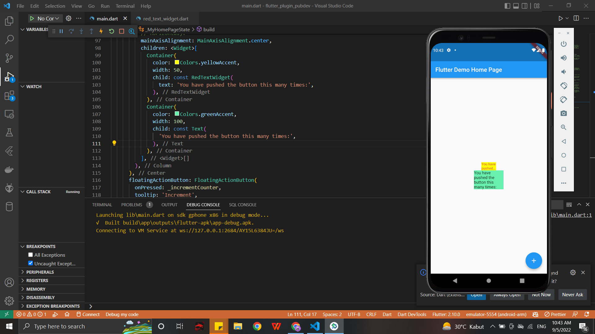

# flutter_plugin_pubdev

#22 | Pengenalan Plugin di Pub.Dev

1. Selesaikan Praktikum tersebut, lalu dokumentasikan dan push ke repository Anda berupa screenshot hasil pekerjaan beserta penjelasannya di file README.md!

Penjelasan:
- Pada saat langkah 4 terjadi error pada bagian code return AutoSizeText : text. Ini terjadi karena belum ada inisiasi untuk variabel tersebut. Maka diperluka inisiasi terlebih dahulu, seperti pad alangkah 5.
2. Jelaskan maksud dari langkah 2 pada praktikum tersebut!
- Langkah 2 menambahkan plugin baru pada project flutter. Di flutter bisa menambah plugin/package dengan perintah 'flutter pub add nama_plugin'.
Selain itu bisa juga langsung menambhakan pada bagian pubspec.yaml. Namun jika ditambahkan di file tersebut, maka harus menambahkan versi berapa.
3. Jelaskan maksud dari langkah 5 pada praktikum tersebut!
- Langkah 5 menunjukkan inisiasi untuk variabel text. Kemudian menambahkan parameter pada constructor kelas dengan inisiasi variabel text tadi.
4. Pada langkah 6 terdapat dua widget yang ditambahkan, jelaskan fungsi dan perbedaannya!
- Langkah 6 memiliki 2 widget yang berbeda. Jika pada widget container awal memiliki child yaitu widget RedTextWidget yang tadi sudah dibuat terlebih dahulu. Sedangkan container ke 2 memiliki child yaitu widget Text.
5. Jelaskan maksud dari tiap parameter yang ada di dalam plugin auto_size_text 
